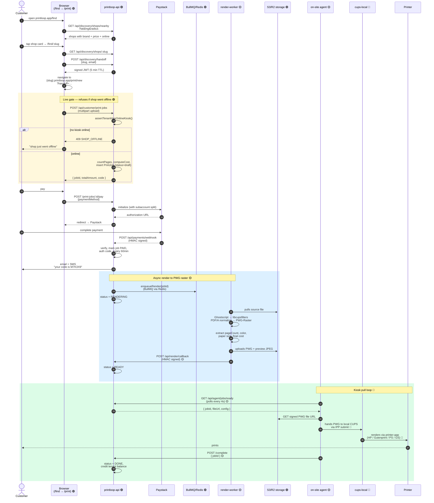
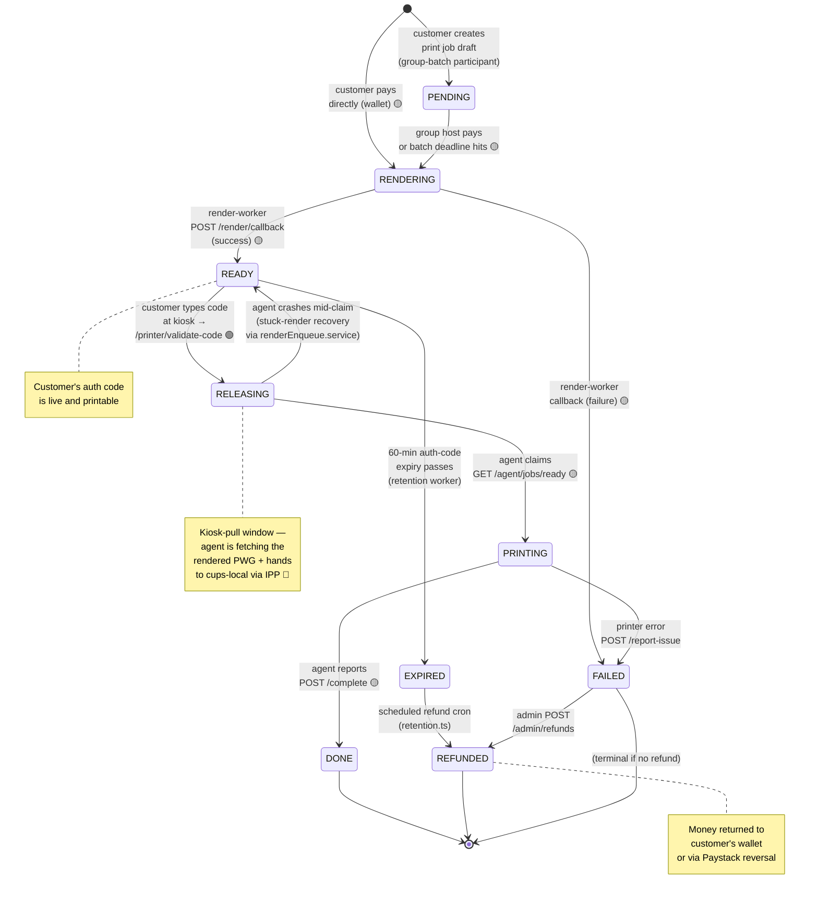

# PrintLoop — operational flowcharts

How PrintLoop works, in seven diagrams. Each one answers a real
operational question.

All diagrams are Mermaid (no setup — GitHub, VS Code, and most
markdown viewers render them inline). File paths next to each
component point at the actual source.

Legend
- 🟢 WIRED — implemented and running
- 🟡 PARTIAL — code exists but not fully integrated
- 🔴 GAP — design only, not started

---

## 1. System architecture — "what are all the moving parts?"

The whole platform on one page. Five processes (api, worker,
render-worker, kiosk-app, agent) plus five external services
(Paystack, S3/R2, Termii, Sentry, OpenStreetMap).

```mermaid
flowchart TB
    %% ── External world ─────────────────────────────────────────
    subgraph External["External (your accounts)"]
        Paystack[("Paystack<br/>Split + Transfer + Webhook 🟢")]
        S3[("S3 / R2<br/>File storage 🟢")]
        Termii[("Termii<br/>SMS 🟢")]
        Sentry[("Sentry<br/>Errors + perf 🟢")]
        OSM[("OpenStreetMap<br/>Map tiles + Nominatim 🟢")]
    end

    %% ── Customer surface ───────────────────────────────────────
    subgraph Browser["Customer browser"]
        Find["/find — marketplace<br/>(map + clusters + filters)<br/>FindPage.tsx 🟢"]
        Shop["/find/:slug — shop detail<br/>ShopDetailPage.tsx 🟢"]
        Print["/print/new — upload + pay<br/>NewPrintPage.tsx 🟢"]
        Login["/login + /saas/dashboard<br/>LoginPage.tsx 🟢"]
    end

    %% ── Tenant / admin browser ─────────────────────────────────
    subgraph TenantBrowser["Tenant admin browser"]
        Saas["/saas/* — shop dashboard<br/>(payouts, branding, kiosks) 🟢"]
        Platform["/platform — SUPER_ADMIN<br/>(tenants, disputes, refunds) 🟢"]
    end

    %% ── Cloud backend ──────────────────────────────────────────
    subgraph Cloud["Cloud (Railway / Render / Fly)"]
        API["printloop-api<br/>(Express + TypeORM)<br/>01-backend/server.ts 🟢"]
        Worker["printloop-worker<br/>(BullMQ scheduled)<br/>01-backend/worker.ts 🟢"]
        RenderW["printloop-render-worker<br/>(BullMQ consumer)<br/>render-worker/src/index.ts 🟡"]
        PG[("Postgres<br/>multi-tenant<br/>tenantId NOT NULL 🟡")]
        Redis[("Redis<br/>BullMQ + rate limit 🟢")]
    end

    %% ── On-site shop PC ────────────────────────────────────────
    subgraph Shop_PC["On-site shop computer"]
        KioskApp["printloop-kiosk-app<br/>(Electron, touchscreen)<br/>main.js + agent.js 🟢"]
        Agent["printloop-agent<br/>(headless, systemd /<br/>Scheduled Task)<br/>agent.ts 🟡"]
        Printer{"Printer<br/>(IPP / raw9100 /<br/>OS spooler)"}
    end

    %% ── OpenPrinting kiosk stack ───────────────────────────────
    subgraph OpenPrinting["OpenPrinting Stack on Kiosk (Linux) 🔴"]
        CupsLocal["cups-local<br/>(process-local IPP server)"]
        CupsBrowsed["cups-browsed<br/>(LAN mDNS/DNS-SD discovery)"]
        IppUsb["ipp-usb<br/>(USB MFP → IPP-over-HTTP)"]
        PrinterApps["printer-apps<br/>(hplip / gutenprint / ps / gs)"]
        CupsSharing["cups-sharing<br/>(multi-kiosk printer sharing)"]
    end

    %% ── Customer paths ─────────────────────────────────────────
    Find -->|GET /api/discovery/shops/nearby| API
    Shop -->|GET /api/discovery/shops/:slug<br/>POST /api/discovery/handoff| API
    Print -->|POST /api/customer/print-jobs| API
    Login -->|POST /api/admin/auth/login| API

    %% ── Tenant paths ───────────────────────────────────────────
    Saas -->|GET /api/saas/me + payouts| API
    Platform -->|GET /api/platform/tenants| API

    %% ── Cloud internals ────────────────────────────────────────
    API <--> PG
    API <--> Redis
    Worker <--> PG
    Worker <--> Redis
    RenderW <--> Redis
    RenderW -->|HMAC POST /api/render/callback| API

    %% ── External wiring ───────────────────────────────────────
    API <-->|init + verify + webhook| Paystack
    API -->|uploadFile| S3
    API -->|sendPrintJobCode + verification| Termii
    API -->|reportError| Sentry
    RenderW -->|reportError| Sentry
    Browser -->|VITE_SENTRY_DSN| Sentry
    Find -->|tile fetch| OSM

    %% ── Shop ↔ cloud ──────────────────────────────────────────
    Agent -->|GET /api/agent/jobs/ready<br/>POST /complete| API
    KioskApp -->|same agent loop, embedded| API
    Agent --> Printer
    KioskApp --> Printer

    %% ── OpenPrinting wiring ───────────────────────────────────
    Agent -.->|uses| CupsLocal
    Agent -.->|discovers via| CupsBrowsed
    Agent -.->|USB printers| IppUsb
    CupsLocal -.->|driver selection| PrinterApps
    CupsBrowsed -.->|shared via| CupsSharing

    %% ── Money out ─────────────────────────────────────────────
    Paystack -.->|payout to shop bank| Shop_PC

    style Paystack fill:#fef3c7,stroke:#f59e0b
    style S3 fill:#fef3c7,stroke:#f59e0b
    style Termii fill:#fef3c7,stroke:#f59e0b
    style Sentry fill:#fef3c7,stroke:#f59e0b
    style OSM fill:#fef3c7,stroke:#f59e0b
    style PG fill:#ede9fe,stroke:#7c3aed
    style Redis fill:#fecaca,stroke:#ef4444
    style Printer fill:#e5e7eb,stroke:#6b7280
    style RenderW fill:#fef3c7,stroke:#f59e0b
    style CupsLocal fill:#fef3c7,stroke:#f59e0b
    style CupsBrowsed fill:#fef3c7,stroke:#f59e0b
    style IppUsb fill:#fef3c7,stroke:#f59e0b
    style PrinterApps fill:#fef3c7,stroke:#f59e0b
    style CupsSharing fill:#fef3c7,stroke:#f59e0b
```



**Maturity key.**
- `printloop-render-worker` 🟡 — exists as code but callback not wired; `print_job_render` table is design-only
- OpenPrinting kiosk stack 🔴 — `cups-local`, `cups-browsed`, `ipp-usb`, `printer-apps`, `cups-sharing` are planned, not deployed
| Multi-tenancy 🟢 |

---

## 2. Customer print flow — "how does a customer actually print?"

End-to-end, from the customer typing the marketplace URL to a sheet
of paper coming out of the shop's printer.



**Status key in diagram:** 🟢 wired, 🟡 partial, 🔴 not yet deployed

Key invariants:
- The **live gate** runs before any expensive work. A shop that just
  dropped offline returns a clean **409 SHOP_OFFLINE**.
- The **authentication code** is single-use, shop-scoped, expires in
  60 minutes. Brute-force protected (10/min per kiosk).
- The **render worker** is async; customer isn't blocked on PDF → PWG.
  Job sits at `RENDERING` for seconds/minutes.
- The **agent pulls** from cloud rather than push. Robust to flaky
  campus Wi-Fi; no socket reconnect dance needed.
- **OpenPrinting stack** (cups-local, cups-browsed, ipp-usb,
  printer-apps, cups-sharing) is the v2 target on Linux kiosks.

---

## 3. Shop onboarding flow — "how does a new shop join?"

From the shop owner clicking "sign up" to the shop appearing on
`/find` for customers.

```mermaid
flowchart TD
    A[Shop owner visits printloop.app/saas/signup] --> B[Fill form:<br/>name, slug, email,<br/>phone, password, address]
    B --> C[POST /api/saas/signup 🟢]
    C --> D{Slug available?<br/>Email unique?}
    D -->|no| E[409 SLUG_TAKEN or<br/>EMAIL_TAKEN]
    D -->|yes| F[Create Tenant + Owner User<br/>+ TenantMember OWNER 🟡<br/>+ Wallet + PayoutSchedule]
    F --> G[Geocode address via<br/>Nominatim/Google<br/>store lat/lng 🟢]
    G --> H[Generate verificationToken<br/>sendTenantOwnerVerification email 🟢]
    H --> I[Owner clicks verify link<br/>POST /verify-email 🟢]
    I --> J[isEmailVerified = true]

    J --> K{Platform admin reviews}
    K -->|approve| L[POST /platform/tenants/:id/reactivate<br/>status = ACTIVE]
    K -->|reject| M[POST /suspend<br/>status = SUSPENDED]

    L --> N[Owner logs in<br/>POST /admin/auth/login 🟢]
    N --> O[/saas/setup/subaccount<br/>create Paystack subaccount 🟢]
    O --> P[/saas/setup/bank-account<br/>add bank for payouts 🟢]
    P --> Q[/admin/kiosks<br/>create kiosk, get API key 🟢]
    Q --> R[Install agent on shop PC<br/>via PrintLoopSetup.exe or<br/>install-kiosk-pc.sh 🟡]
    R --> S[Run test print<br/>POST /admin/kiosks/:id/test-print-pass 🟡]

    S --> T{Live gate}
    T -->|TENANT_NOT_ACTIVE| U[Wait for admin approve]
    T -->|LOCATION_MISSING| V[Set address again]
    T -->|TEST_PRINT_MISSING| W[Run test print first]
    T -->|NO_KIOSK_ONLINE| X[Bring kiosk online]
    T -->|all pass| Y[PATCH /saas/me/location<br/>{isDiscoverable: true} 🟢]

    Y --> Z[Shop appears on /find<br/>with brand + price + pin 🟢]
    Z --> AA[Customers can mint<br/>handoff tokens]
    AA --> AB[Shop receives jobs<br/>weekly payout every Friday]

    style A fill:#fef3c7
    style L fill:#bbf7d0
    style Z fill:#bbf7d0
    style AB fill:#bbf7d0
    style E fill:#fecaca
    style M fill:#fecaca
    style F fill:#fef9c3
    style R fill:#fef9c3
    style S fill:#fef9c3
```

The **live gate** is the trust mechanism. A tenant doesn't appear on
`/find` until they've demonstrated all four:

1. coordinates exist (geocoded address)
2. account status is ACTIVE (not trial / suspended)
3. at least one kiosk has a successful test print recorded
4. at least one kiosk has heartbeated in the last 5 minutes

`assertLiveGateMet()` lives in `saas.routes.ts` and runs on every
`PATCH /me/location { isDiscoverable: true }`. Each failure has its
own reason code so the tenant admin's UI can render specific
"do this next" guidance.

---

## 4. Money flow — "how does money move?"

What happens between the customer paying ₦700 and the shop owner
seeing ₦616 in their bank account.

```mermaid
flowchart LR
    A[Customer pays ₦700<br/>via Paystack popup] --> B[Paystack<br/>split engine 🟢]
    B -->|"split: 88% (₦616)"| C[Shop's Paystack<br/>subaccount]
    B -->|"split: 12% (₦84)"| D[PrintLoop main<br/>Paystack account]

    C --> E[ShopWallet credit<br/>(via webhook handler) 🟢]
    D --> F[PrintLoop revenue<br/>(commission table) 🟢]

    E --> G{PayoutSchedule}
    G -->|"weekly, Friday<br/>(default)"| H[Worker enqueues<br/>scheduled payout 🟢]
    G -->|"instant request"| I[POST /saas/payouts/instant<br/>(₦100 fee) 🟡]

    H --> J[Paystack<br/>Transfer API 🟢]
    I --> J
    J --> K[Shop bank account]
    K --> L[Shop owner receives ₦616<br/>minus instant fee if applicable]

    %% ── refund path ──────────────────────────────────────────
    A -.->|"if code expires<br/>or shop fails"| M[Refund flow 🟢]
    M --> N[POST /api/admin/refunds<br/>or RefundService.issueRefund]
    N --> O{Refund destination}
    O -->|wallet| P[Customer wallet credit 🟢]
    O -->|paystack| Q[Paystack reversal API 🟡]

    style A fill:#fef3c7
    style L fill:#bbf7d0
    style F fill:#bbf7d0
    style P fill:#fbcfe8
    style Q fill:#fef9c3
    style I fill:#fef9c3
```

Two important properties of this design:

- **No held-in-escrow money** — Paystack Split routes the customer's
  payment to the shop's subaccount **at charge time**. This is the
  Bolt-Nigeria pricing model. Simpler than escrow; no "the platform
  is holding our money" complaints from shops; cleaner accounting.
- **Commission is a database row, not a held balance** — every
  charge creates a Transaction with `commissionAmount` populated.
  The CSV month-end statement (V2-23) sums these.

`commission.service.ts` covers the math. Tested in
`tests/commission.service.test.ts` — covers rounding edge cases (no
fractional kobo), 50% rate clamp (refuses misconfigured tenants),
and gross-positive enforcement.

---

## 5. Print job state machine — "what states can a job be in?"

Every `PrintJob.status` transition the system can make. Some are
customer-triggered, some are async worker callbacks, some are
admin-triggered.



Each transition is **idempotent under retries**. The agent's
"claim → print → complete" loop can replay the same step without
double-charging or double-printing because:

- `validate-code` checks the code is still in `READY` state, not used
- `claim` flips `READY → RELEASING` atomically (only one agent wins
  the race)
- `complete` is a no-op if status is already `DONE`

The **stuck-render recovery** path (in `renderEnqueue.service.ts`)
sweeps jobs that got stuck at `RELEASING` for too long — typically
when an agent crashed mid-claim — and bumps them back to `READY` so
another agent can pick them up.

---

## 6. Render worker pipeline — "how does a PDF become print-ready?"

Detailed view of the cloud render pipeline. This is the **new v2
component** that replaces v1's raw-PDF push.

```mermaid
flowchart LR
    A[PDF/DOCX/JPG<br/>uploaded by customer 🟢] --> B[S3/R2<br/>source file 🟢]
    B --> C[Render worker<br/>picks up BullMQ job 🟡]

    C --> D[Ghostscript<br/>normalize → PDF/A 🟡]
    D --> E[libcupsfilters<br/>pdfToPwg → PWG-Raster 🟡]
    E --> F[Extract metadata:<br/>pageCount, color,<br/>paper size 🟡]
    F --> G[S3/R2<br/>PWG + preview JPEG 🟡]
    G --> H[HMAC callback<br/>POST /api/render/callback 🟡]
    H --> I[Backend updates job:<br/>status=READY,<br/>pageCount, finalCost 🟡]
    I --> J[Kiosk pulls PWG<br/>from S3 🟡]
    J --> K[cups-local<br/>IPP submit 🔴]
    K --> L[printer-app<br/>(HP / Gutenprint / PS) 🔴]
    L --> M[Paper comes out<br/>of printer]

    style A fill:#bbf7d0
    style B fill:#bbf7d0
    style C fill:#fef9c3
    style D fill:#fef9c3
    style E fill:#fef9c3
    style F fill:#fef9c3
    style G fill:#fef9c3
    style H fill:#fef9c3
    style I fill:#fef9c3
    style J fill:#fef9c3
    style K fill:#fecaca
    style L fill:#fecaca
    style M fill:#bbf7d0
```

**Fallback path:** if a tenant hasn't configured a `printerProfileId`,
the kiosk skips the render step and falls back to v1 behaviour
(raw PDF → OS spooler). This keeps existing shops working during
the v2 rollout.

---

## 7. Kiosk local print stack — "what runs on the shop PC?"

The OpenPrinting components that sit on the kiosk (Linux preferred
for v2). Windows kiosks keep the existing `install-kiosk-pc.ps1`
path and skip `ipp-usb` / `printer-apps`.

```mermaid
flowchart TB
    A[printloop-agent<br/>(Node, heartbeats every 15s) 🟡] -->|pull loop| B[GET /api/agent/jobs/ready<br/>GET signed PWG from S3]

    B --> C{Transport selection}
    C -->|IPP network| D[cups-local<br/>(process-local IPP server,<br/>no system daemon) 🔴]
    C -->|raw9100| E[Direct raw socket<br/>to printer 🟢]
    C -->|OS spooler| F[Windows / CUPS<br/>system spooler 🟢]

    D --> G[Printer Application<br/>(printer-apps)]
    G -->|HP models| H[hplip-printer-app 🔴]
    G -->|generic inkjet| I[gutenprint-printer-app 🔴]
    G -->|PostScript laser| J[ps-printer-app 🔴]
    G -->|fallback| K[ghostscript-printer-app 🔴]

    L[cups-browsed<br/>(LAN mDNS/DNS-SD<br/>auto-discovery) 🔴] -->|adds| M[Network printers<br/>auto-detected]
    M --> D

    N[ipp-usb<br/>(USB MFP → IPP-over-HTTP<br/>on localhost:60000) 🔴] -->|adds| O[USB printers<br/>as IPP devices]
    O --> D

    P[cups-sharing<br/>(multi-kiosk<br/>printer sharing) 🔴] -->|allows| Q[Second kiosk<br/>submits to same printer]
    Q --> D

    D --> R[Physical output<br/>on paper]

    style A fill:#fef9c3
    style B fill:#fef9c3
    style C fill:#fef9c3
    style D fill:#fecaca
    style E fill:#bbf7d0
    style F fill:#bbf7d0
    style G fill:#fecaca
    style H fill:#fecaca
    style I fill:#fecaca
    style J fill:#fecaca
    style K fill:#fecaca
    style L fill:#fecaca
    style M fill:#fecaca
    style N fill:#fecaca
    style O fill:#fecaca
    style P fill:#fecaca
    style Q fill:#fecaca
    style R fill:#bbf7d0
```

**Why this split?**
- `cups-local` is CUPS 3.0's no-daemon mode — runs as the kiosk
  user, no root, no port 631 conflicts with the OS spooler.
- `printer-apps` are the modern driver model (one executable per
  vendor family); they replace the old `/etc/cups/ppd/` approach.
- `ipp-usb` makes USB printers network-transparent — the agent
  doesn't need special USB code.
- `cups-sharing` lets two kiosks in the same shop share one
  expensive MFP without fighting over the USB bus.

---

## What this doesn't show

Each flowchart is one viewpoint. Things that intentionally don't
appear above:

- **Auth refresh / 2FA paths** — covered in
  `customerAuth.routes.ts:login` and `saas.routes.ts:2fa/*`
- **Branding cascade** — `BrandProvider.tsx` →
  `setSentryTenant()` + CSS vars; pulls from
  `/api/branding` on every page load
- **Custom domain claim** — the DNS verification dance
  (`tenantDomain.entity.ts` + `customDomain.service.ts`)
- **Webhook delivery retry queue** — `workers/webhook.worker.ts`
  with exponential backoff and a hard cap
- **Dispute resolution** — `routes/dispute.routes.ts` →
  `RefundService.issueRefund()`

For each: read the corresponding route or service file. The
`OBSERVABILITY.md` doc plus the `OpenAPI 3.1 spec` at
`/api/openapi.json` (Swagger UI at `/api/docs`) are the two best
indices into the running system.

---

## Last updated
2026-06-12 — v2 target-state refresh with OpenPrinting stack
