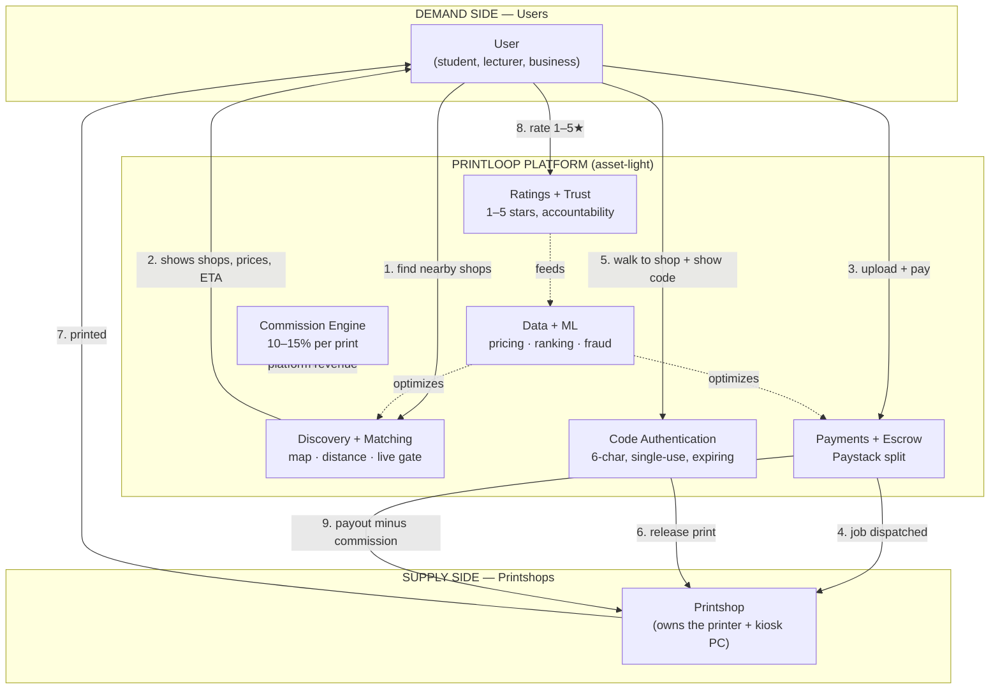
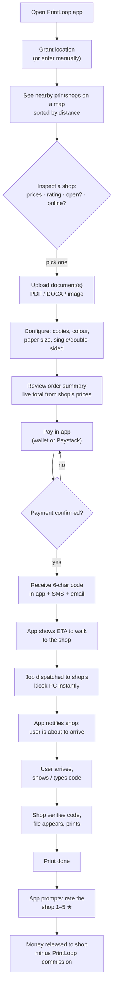
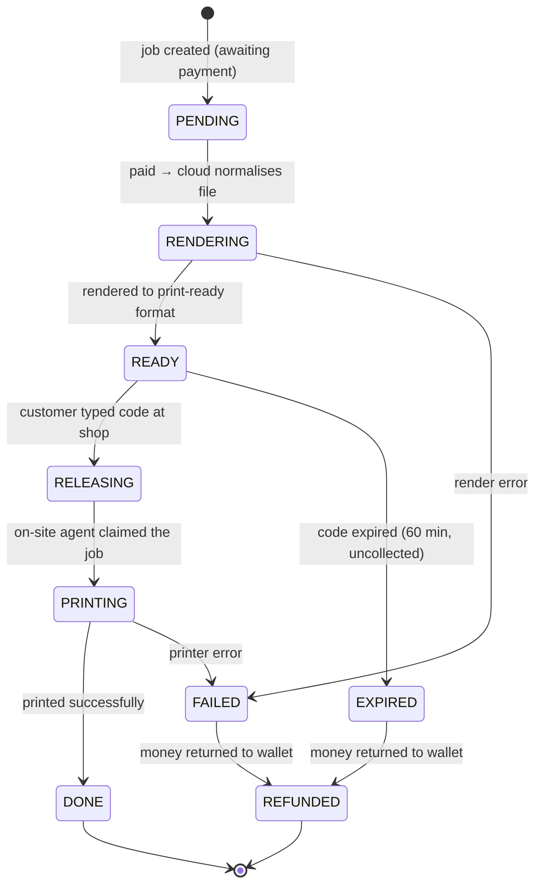
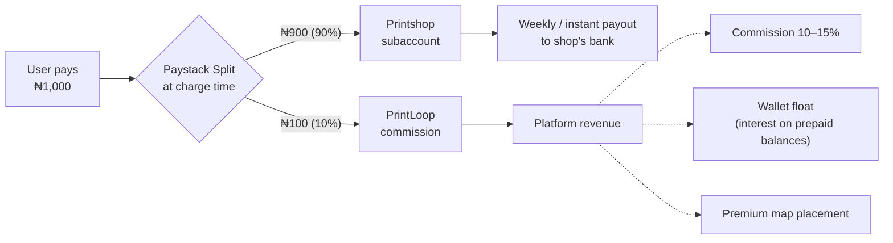
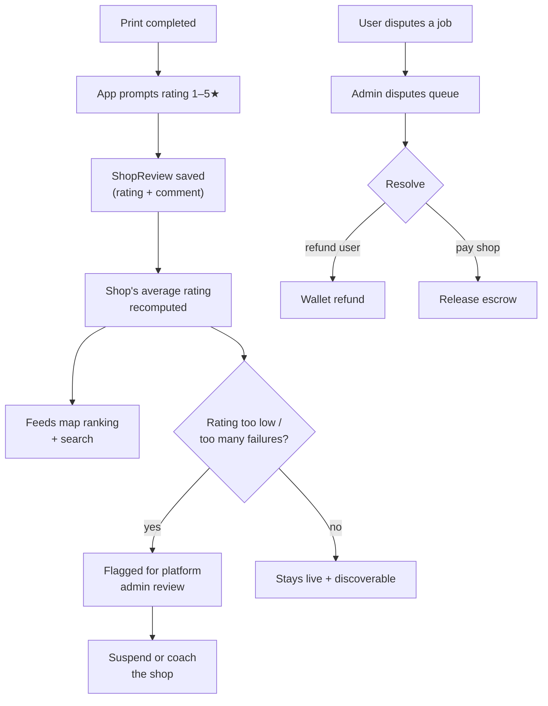
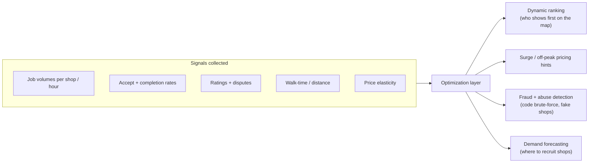
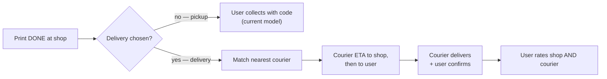
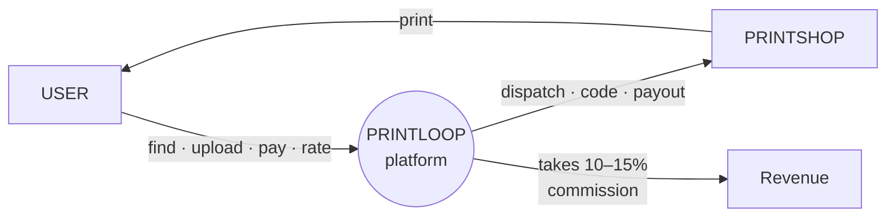

# How PrintLoop works

PrintLoop is a **two-sided digital marketplace** — the Uber model applied to
printing. It connects:

- **Users** who need something printed
- **Printshops** who own the printers and do the printing

PrintLoop owns no printers and no shops. It is the **technology platform** that
matches demand to supply in real time, authenticates the handoff with a code,
and takes a commission on each transaction. This is an **asset-light platform
business** built on three pillars:

1. **Marketplace connectivity** — discovery + matching (the map, the live gate)
2. **Commission-based revenue** — a % of each print, taken before payout
3. **Data-driven optimization** — pricing, ranking, and fraud signals from usage

> **A note on the Uber analogy.** Uber moves a *driver* to the rider. PrintLoop
> doesn't move anything physical to the user by default — the **user walks to
> the printshop** and collects the printout. So "ETA" here is the user's
> estimated walk time to the shop, and "earnings" go to the **printshop**, not a
> driver. A courier/delivery leg (printshop → user's door) is a *future*
> add-on, not in the current build — see [§ Optional courier leg](#optional-courier-leg).

---

## 1. The two-sided marketplace (high level)

---

## 2. The user journey (Uber-style, step by step)

### What backs each step in the codebase

| Step | Backend / frontend |
|---|---|
| Find nearby shops | `GET /api/discovery/shops/nearby?lat&lng&radius` (Haversine) → `/find` map |
| Inspect a shop | `GET /api/discovery/shops/:slug` → `/find/:slug` (pricing matrix, rating, online status) |
| Upload | `POST /api/customer/files/upload` (Cloudinary, page-count) |
| Configure + price | per-shop `PricingConfig` 24-cell matrix |
| Pay | `POST /api/customer/print-jobs/:id/pay` (wallet) / Paystack split |
| 6-char code | generated on `PAID`, single-use, expiring; sent via `EmailService` + `SMSService` (Termii) |
| Dispatch to shop | BullMQ queue → kiosk PC's agent claims via `/api/agent/*` |
| Shop verifies code | `POST /api/printer/validate-code` (brute-force-rate-limited) |
| Print | agent dispatches via IPP / raw9100 / OS spooler |
| Rate 1–5★ | `ShopReview` entity (rating 1–5 + comment) |
| Payout minus commission | `commission.service.ts` (10% default) → Paystack subaccount split |

---

## 3. The job lifecycle (state machine)

This is the actual `PrintJobStatus` enum the backend runs.

**Escrow rule:** the customer's money is captured at payment but only **released
to the shop when the job reaches `DONE`**. If the code expires uncollected
(`EXPIRED`) or the print fails (`FAILED`), it auto-refunds to the customer's
wallet. A cron sweep (`workers/retention.ts`) handles expiry.

---

## 4. The money flow (commission-based revenue)

**Three revenue streams** (your model):
1. **Commission** — 10–15% of every print cost, taken before payout. Default 10%,
   negotiable per shop. Implemented via Paystack Split — the shop's cut routes
   straight to their subaccount; PrintLoop's cut is the platform's.
2. **Wallet float** — users prepay into a wallet; the held balance earns interest.
3. **Premium placement** — shops can pay to rank higher on the map.

The split is computed in `commission.service.ts` (money-math unit-tested) and
routed by Paystack. The shop never has to invoice PrintLoop — the cut is taken
at the moment of charge.

---

## 5. The trust + accountability loop

The feedback system fosters "a community of respect and accountability": every
print ends with a rating, ratings drive map ranking, and consistently poor
shops get flagged to the platform admin (`/admin/disputes` queue) for coaching
or suspension. Disputes are resolved case-by-case with refund / pay-shop /
split options.

---

## 6. Real-time data + ML optimization (the third pillar)

> **Build status:** the **data capture** is live (structured pino logs with
> `tenantId`, ratings, job states, the observability stack in
> `OBSERVABILITY.md`). The **ML optimization layer** is the roadmap target — the
> signals are being collected now so the models have history to train on later.
> Today, ranking is distance + online-status + rating; dynamic ML pricing is the
> next-phase upgrade.

---

## Optional courier leg

Your brief mentioned "couriers" and "transportation." The current build is
**collect-at-shop** (user walks to the shop, Uber-Eats-style pickup). If you want
a **delivery** model (printshop → courier → user's door), here's where it slots
in — it's a real future feature, **not built yet**:

Adding this would mean: a `Courier` role + entity, a courier matching service
(reuse the Haversine discovery code), a third commission split leg, and a
courier app surface. Ballpark 3–4 weeks. Say the word and I'll scope it as a
phase.

---

## One-glance summary

**The whole thing in one line:** user finds a nearby shop on a map → uploads +
pays in-app → gets a code → walks over → shows the code → shop prints it →
user rates the shop → PrintLoop keeps a commission and pays the shop the rest.

---

## How to view these diagrams

The diagrams above are [Mermaid](https://mermaid.js.org/). They render
automatically on **GitHub**, in **VS Code** (with the "Markdown Preview Mermaid
Support" extension), and on [mermaid.live](https://mermaid.live) (paste a block).
If you're reading raw text and want images, paste any block into mermaid.live to
get a PNG/SVG.

---

## Last updated
2026-06-09
